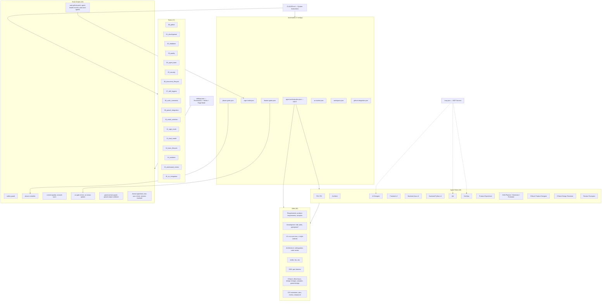
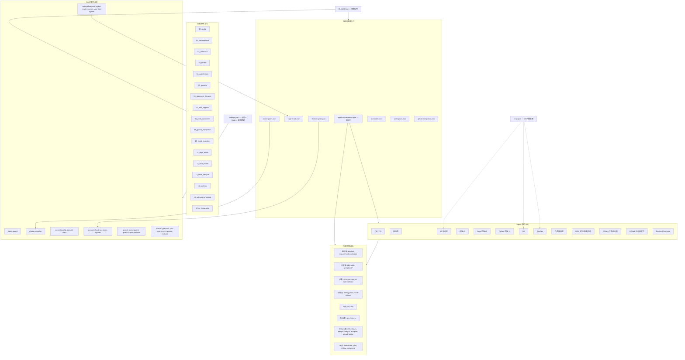

# Claude Enterprise Starter

[English](#-english) | [中文](#-中文)

---

## 📖 English

> 🚀 Enterprise-grade Claude Code configuration template with Agent Team orchestration, Rage Mode automation, TDD workflow, and production-ready configurations.

[](https://code.claude.com)
[](./CLAUDE.md)
[](LICENSE)

### Core Architecture

**What It Does**: This is not an application framework — it's a **development engine configuration layer** for Claude Code. It provides AI Agent orchestration, quality gates, automated pipelines, and production-ready configurations that let Claude Code autonomously develop enterprise-grade projects.

**How It Works**: Projects go through a 5-phase pipeline (Phase 0: Init → Phase 0.5: Product Design [optional, GStack] → Phase 1: Requirements → Phase 2: Development → Phase 3: Testing → Phase 4: UX Review → Phase 5: Deployment), with each phase requiring quality gate passage. A separate GAN Harness loop (Planner → Generator → Evaluator) handles quality-driven feature development.

**Key Metrics**: 16 Agent roles | 38 Skills | 18 Hook scripts | 17 Rule files | 7 Automation configs

**Quick Start**: Copy `.claude/` to your project → run `claude` → type `/doctor` to validate. See [Operation Manual (Chinese)](docs/GUIDE.md#十二操作手册最佳实践与命令速查) for detailed workflows and command reference.

### Module Dependency Topology



### Features

| Feature | Description |
|---------|-------------|
| **Agent Team** | 16 specialized roles collaborating in parallel (PM, PO, Architect, Designer, Frontend, Backend-Java, Backend-Python, QA, DevOps, Product Experience, GAN Planner/Generator/Evaluator, GStack Product Designer, GStack Design Reviewer, Review Champion) |
| **Rage Mode** 🔴 | Full automation - auto GitHub push, agent health monitoring, phase advancement |
| **TDD Workflow** | Enforced Test-Driven Development with Red-Green-Refactor cycle |
| **Quality Gates** | 4-stage verification: functionality, code review, testing, documentation |
| **Skills System** | 38 integrated skills with advanced frontmatter configuration |
| **Backend Dual-Stack** 🆕 | Java + Python backend (SpringBoot + Prisma + LLM + VLM + Workflow) |
| **GAN Harness** 🆕 | Planner→Generator→Evaluator loop for quality-driven development |
| **Hook Reinforcement** 🆕 | 18 hooks covering full lifecycle (commit quality, config protection, edit accumulator, GStack guards) |
| **Continuous Learning** 🆕 | Instinct-based learning system with confidence scoring |
| **Frontmatter Config** | `effort`, `paths`, `allowed-tools`, `user-invocable` for precise skill control |
| **UI Style Selector** | 60 brand design templates with auto-scenario matching |
| **Tech Stack** | React + TypeScript + Vite 6 (frontend fixed), Java + SpringBoot + Python (backend) |
| **SSOT Architecture** | `automation/agent-orchestration.json` as single source of truth |
| **Per-Role SOP** | Standard Operating Procedure for all 16 agent roles |
| **Document System** | Frozen/Evolution/ADR document layers with design-context skill for auto-loading |
| **Skill Triggers** | Global phase flowchart (Phase 1-5) + dynamic trigger rules |
| **Commands** | Custom slash commands: `/commit`, `/pr`, `/review` |
| **Smart Mode Selection** 🆕 | modeSelection scoring engine — auto-decide Team vs Subagent per phase |
| **Team Cleanup** 🆕 | `team-manager.sh` — resolves 5 TeamDelete bugs, safe cleanup workflow |
| **Codex Dual-Model** 🆕 | GLM-5.1 for development + GPT-5.5 for review via Codex integration |
| **Env Optimization** 🆕 | `AUTOCOMPACT_PCT=80`, `MAX_THINKING_TOKENS=16000` for optimal performance |
| **GStack Integration** 🆕 | Phase 0.5 Product Design layer - YC-style ideation, design exploration, automated review, seamless handoff to PRD |
| **Design Shotgun** 🆕 | Generate 4-6 UI variants, browser comparison panel, taste memory for iterative design |
| **Auto Plan Review** 🆕 | Automated CEO→Design→Engineering→DX review pipeline with scoring ≥7.0 threshold |

### Technology Stack (Inferred from Configuration)

| Category | Technology | Source |
|----------|-----------|--------|
| Frontend Framework | React 19 + TypeScript (strict) | `CLAUDE.md` Section I-B |
| Frontend Build | Vite 6 + pnpm 9 | `CLAUDE.md` Section I-B |
| Frontend Test | Vitest + React Testing Library | `CLAUDE.md` Section I-B |
| Backend Java | Spring Boot 3.x + JPA + Maven | `CLAUDE.md` Section I-B |
| Backend Python | Python 3.12+ + Prisma + FastAPI | `CLAUDE.md` Section I-B |
| AI/ML | OpenAI SDK + Anthropic SDK | `CLAUDE.md` Section I-B |
| Workflow Engine | Flowable (Java) / Prefect (Python) | `CLAUDE.md` Section I-B |
| MCP Tools | GitHub / Figma / Playwright / Context7 | `.mcp.json` |
| Hook Runtime | Node.js | `hooks/scripts/*.js` |
| Config Validation | Node.js (test runner) | `scripts/validate-config.js` + `test/` (154 tests) |
| Code Review | GLM-5.1 (dev) + GPT-5.5 via Codex (review) | `CLAUDE.md` Section XVI |
| Lint / Format | ESLint flat config (antfu style) | `CLAUDE.md` Section I-B |

### Navigation Guide

> Want to modify something? Here's where to look.

| Goal | Key Files |
|------|-----------|
| Add a new Agent role | `agents/` (new `.md`) + `automation/agent-orchestration.json` + `CLAUDE.md` Section X & XI |
| Add a new Skill | `skills/<name>/SKILL.md` + `CLAUDE.md` Section XI |
| Change development rules | `rules/*.md` (corresponding file) |
| Adjust quality gate conditions | `automation/phase-gates.json` + `hooks/scripts/phase-controller.js` |
| Change frontend tech stack | `rules/01_development.md` + `CLAUDE.md` Section I-B (requires ADR) |
| Adjust Hook behavior | `hooks/hooks.json` (definitions) + `hooks/scripts/*.js` (implementations) |
| Change phase pipeline flow | `automation/rage-mode.json` + `automation/agent-orchestration.json` |
| Modify permissions / security | `settings.json` permissions + `rules/05_security.md` |
| Add a new MCP tool | `.mcp.json` + corresponding `agents/*.md` (declare MCP dependency) |
| Change code comment standards | `rules/08_code_comments.md` + `templates/code-headers/` |
| Adjust AC acceptance flow | `automation/feature-gates.json` + `automation/ac-tracker.json` + `scripts/ac-*.js` |
| Change UI design workflow | `skills/ui-style-selector/` + `tips/UI设计风格/` |
| Configure workspace path | `automation/workspace.json` + `hooks/scripts/lib/workspace-resolver.js` |
| Dual-model Codex integration | `CLAUDE.md` Section XVI + Codex plugin hooks |
| Enable/disable GStack | `scripts/gstack-toggle.js` + `automation/agent-orchestration.json` gstackConfig |

### Quick Start

```bash
# Clone the template
git clone https://github.com/circleone1980/claude-enterprise-starter.git

# Copy to your project
cp -r claude-enterprise-starter/.claude your-project/
cp claude-enterprise-starter/.mcp.json your-project/

# Create local config (gitignored)
cp claude-enterprise-starter/CLAUDE.local.md.example your-project/CLAUDE.local.md
```

### Directory Structure

```
.claude/
├── CLAUDE.md                        # Core instructions (12 sections)
├── settings.json                    # Permissions, hooks, rage mode config
├── settings.local.json              # Local overrides (gitignored)
├── rules/                           # Modular rules (17 files)
│   ├── 00_global.md                 # Language, startup constraints
│   ├── 01_development.md            # Development constraints + tech stack
│   ├── 02_database.md               # Database standards
│   ├── 03_quality.md                # Quality gates
│   ├── 04_agent_team.md             # Agent Team rules (references SSOT)
│   ├── 05_security.md               # Security standards
│   ├── 06_document_lifecycle.md     # Document lifecycle (Frozen/Evolution/ADR)
│   ├── 07_skill_triggers.md         # Skill triggers + global phase flowchart
│   ├── 08_code_comments.md          # Code comment standards (Chinese + versioning) 🆕
│   ├── 09_gstack_integration.md     # GStack Phase 0.5 integration rules 🆕
│   ├── 10_mode_selection.md         # Mode selection engine (Team vs Subagent) 🆕
│   ├── 11_rage_mode.md              # Rage mode (full auto development) 🆕
│   ├── 12_dual_model.md             # Dual model strategy (GLM-5.1 + GPT-5.5) 🆕
│   ├── 13_team_lifecycle.md         # Team lifecycle (create/disband) 🆕
│   ├── 14_worktree.md               # Git worktree management 🆕
│   ├── 15_adversarial_review.md     # Adversarial review rules 🆕
│   └── 16_ce_integration.md         # CE plugin integration 🆕
├── skills/                          # Skills (38 skills from ECC/superpowers/gstack/official/custom)
│   ├── ui-style-selector/           # UI style auto-selection (60 templates)
│   ├── design-context/              # Auto-load design docs by role
│   ├── tdd/                         # TDD workflow
│   ├── code-review/                 # Code review (effort: high)
│   ├── writing-plans/               # Architecture planning (effort: high)
│   ├── product-requirements/        # Requirements analysis (effort: high)
│   ├── user-onboarding/             # FTUE design (effort: high)
│   ├── ui-ux-pro-max/               # UI/UX best practices (paths: *.tsx)
│   ├── react-best-practices/        # React patterns (auto-activate on .tsx)
│   ├── antfu/                       # ESLint/TS/pnpm/Vitest (auto-activate)
│   ├── vitest/                      # Vitest testing patterns 🆕
│   ├── pnpm/                        # pnpm workspace & monorepo config 🆕
│   ├── prisma-database-setup/       # Prisma DB config (paths: *.prisma)
│   ├── springboot-patterns/         # SpringBoot architecture patterns 🆕
│   ├── springboot-tdd/              # SpringBoot TDD workflow 🆕
│   ├── springboot-security/         # SpringBoot security config 🆕
│   ├── jpa-patterns/                # JPA data access patterns 🆕
│   ├── java-coding-standards/       # Java coding standards 🆕
│   ├── llm-integration/             # LLM API integration 🆕
│   ├── vlm-integration/             # VLM vision model integration 🆕
│   ├── verification-loop/           # 6-phase verification cycle 🆕
│   ├── search-first/                # Research before coding 🆕
│   ├── security-review/             # 10-domain security audit 🆕
│   ├── strategic-compact/           # Strategic context compression 🆕
│   ├── gan-harness/                 # GAN development loop 🆕
│   ├── continuous-learning/         # Instinct-based learning 🆕
│   ├── office-hours/               # YC 6 问产品构思 🆕
│   ├── design-consultation/        # 竞品研究+设计系统 🆕
│   ├── design-shotgun/             # UI 变体对比探索 🆕
│   ├── design-html/                # 模型转 HTML/CSS 🆕
│   ├── autoplan/                   # 自动全流程审查 🆕
│   ├── plan-ceo-review/            # CEO 范围挑战 🆕
│   ├── plan-design-review/         # 设计评分审查 🆕
│   ├── plan-eng-review/            # 工程架构审查 🆕
│   ├── plan-devex-review/          # 开发者体验审查 🆕
│   └── gstack-bridge/              # Phase 0.5→1 交接 🆕
├── agents/                          # Agent definitions with SOP (16 roles)
│   ├── pm.md                        # Project Manager
│   ├── po.md                        # Product Owner
│   ├── architect.md                 # Architect
│   ├── ui-designer.md               # UI Designer
│   ├── frontend.md                  # Frontend Developer
│   ├── backend-java.md              # Java Backend Developer 🆕
│   ├── backend-python.md            # Python Backend Developer 🆕
│   ├── qa.md                        # QA Engineer
│   ├── devops.md                    # DevOps Engineer
│   ├── product-experience.md        # Product Experience Tester
│   ├── gan-planner.md               # GAN Product Spec Designer 🆕
│   ├── gan-generator.md             # GAN Code Generator 🆕
│   ├── gan-evaluator.md             # GAN Quality Evaluator 🆕
│   ├── product-designer.md         # GStack Product Designer 🆕
│   ├── design-reviewer.md          # GStack Design Reviewer 🆕
│   └── review-champion.md          # Review Champion 🆕
├── automation/                      # Automation configs
│   ├── agent-orchestration.json     # SSOT: role-skill mapping
│   ├── rage-mode.json               # Rage mode phases & features
│   ├── phase-gates.json             # Quality gate conditions
│   ├── feature-gates.json           # Feature-level AC gates 🆕
│   ├── ac-tracker.json              # AC status machine-readable index 🆕
│   ├── workspace.json               # Workspace path config 🆕
│   └── github-integration.json      # GitHub auto-push config
├── hooks/                           # Hook system
│   ├── hooks.json                   # Hook definitions
│   └── scripts/                     # Hook scripts (18 scripts)
│       ├── lib/workspace-resolver.js # Workspace path resolver 🆕
│       ├── safety-guard.js          # Pre-tool safety check
│       ├── phase-controller.js      # Phase gate validator
│       ├── auto-github-push.js      # Auto push (every 30min)
│       ├── agent-health-monitor.js  # Agent health check (every 5min)
│       ├── auto-start-agents.js     # Auto-start agents on team create
│       ├── ac-gate-check.js         # Feature AC gate checker 🆕
│       ├── ac-status-update.js      # AC status auto-update on task complete 🆕
│       ├── block-no-verify.js       # Block git push --no-verify 🆕
│       ├── commit-quality.js        # Pre-commit: console.log + secrets detection 🆕
│       ├── suggest-compact.js       # Suggest /compact at logical boundaries 🆕
│       ├── config-protection.js     # Block linter/formatter config changes 🆕
│       ├── edit-accumulator.js      # Accumulate edited files for batch processing 🆕
│       ├── console-warn.js          # Detect console.log in edits 🆕
│       ├── format-typecheck.js      # Batch format + typecheck on stop 🆕
│       ├── doc-sync-check.js        # Remind to sync docs on stop 🆕
│       ├── session-evaluate.js      # Session evaluation on stop 🆕
│       ├── gstack-phase-guard.js    # GStack phase boundary guard 🆕
│       └── gstack-output-validator.js # GStack output schema validator 🆕
├── commands/                        # Slash commands
│   ├── commit.md                    # /commit
│   ├── pr.md                        # /pr
│   └── review.md                    # /review
├── output-styles/                   # Output format variants
│   ├── terse.md                     # Concise output
│   ├── detailed.md                  # Detailed output
│   └── enterprise.md                # Enterprise report format
├── agent-memory/                    # Persistent agent memory
│   └── {role}/MEMORY.md             # Per-agent memory files
└── scripts/                         # Setup scripts
    ├── init.sh                      # Unix setup script (supports --workspace)
    ├── init.ps1                     # Windows setup script (supports -Workspace)
    ├── team-manager.sh              # Team cleanup (resolves 5 TeamDelete bugs) 🆕
    ├── orchestrate.sh               # Agent orchestration launcher 🆕
    ├── gan-harness.sh               # GAN harness runner 🆕
    ├── ac-tracker-sync.js           # AC markdown → JSON sync 🆕
    ├── ac-coverage-report.js        # AC coverage report generator 🆕
    └── validate-config.js           # Configuration validator 🆕

templates/
└── code-headers/                    # Code comment templates 🆕
    ├── typescript.ts.template       # TS/JS module header + JSDoc
    ├── java.java.template           # Java module header + Javadoc
    ├── python.py.template           # Python module header + docstring
    └── README.md                    # Template usage guide

workspace/                           # Target project directory 🆕
├── src/                             # Actual application code
├── docs/                            # Project documentation (from templates)
├── requirements/                    # Frozen layer: PRD, user stories
│   ├── PRD.md                       # Product Requirements Document
│   ├── user-stories.md              # User stories
│   └── acceptance-criteria.md       # Acceptance criteria
├── design/                          # Frozen layer: System design
│   ├── 01_系统架构设计.md             # Architecture design
│   ├── 02_数据库设计.md               # Database design
│   ├── 03_API接口设计.md              # API design
│   └── 04_UI设计规范.md              # UI design spec
├── dev/                             # Evolution layer: Dev guides
│   ├── 01_开发环境搭建.md             # Environment setup
│   ├── 02_编码规范.md                 # Coding standards
│   └── 03_Git工作流.md               # Git workflow
├── test/                            # Evolution layer: Test docs
│   ├── 01_测试计划.md                 # Test plan
│   ├── 02_测试用例.md                 # Test cases
│   └── 03_验证记录.md                # Verification records
├── fixes/                           # Evolution layer: Fixes
│   └── CHANGELOG.md                 # Changelog
├── sql/                             # Database scripts
├── superpowers/                     # ADR + brainstorming
│   ├── decisions/                   # Architecture Decision Records
│   └── specs/                       # Brainstorming specs
├── templates/                       # 📋 Document templates (copy to use)
│   ├── requirements/
│   ├── design/
│   ├── dev/
│   ├── test/
│   ├── fixes/
│   └── superpowers/
└── GUIDE.md                         # 📖 Detailed usage manual

tips/                                # Reference guides & design resources
├── Claude Code Skills功能指南.md     # Skills optimization guide
└── UI设计风格/                       # 60 brand design templates
    ├── ui风格对照表.md                # Scenario ↔ Style mapping table
    └── design-md/                    # {style}/DESIGN.md per style

.mcp.json                            # MCP server configs (GitHub, Figma, Playwright...)
.worktreeinclude                     # Git worktree config
CLAUDE.local.md.example              # Local config template (gitignored)
QUICKSTART.md                        # 5-minute quick start guide
package.json                         # Test infrastructure (zero external deps) 🆕
.github/workflows/validate.yml       # CI: validate + test on push/PR 🆕
test/                                # Automated test suite (154 tests) 🆕
├── helpers/                         # Shared test utilities
├── static/                          # Config validation tests (30)
├── hooks/                           # Hook script tests (64)
└── integration/                     # Integration tests (60)
```

### Skills Frontmatter Configuration

| Skill | effort | paths | Special Config |
|-------|--------|-------|----------------|
| **design-context** | low | - | `user-invocable: false`, `disable-model-invocation: true`, `allowed-tools: Read Grep Glob` |
| **react-best-practices** | - | `**/*.tsx,**/*.jsx` | `user-invocable: false` (auto-activate) |
| **antfu** | - | `**/*.ts,**/*.tsx,**/*.js,**/*.jsx` | `user-invocable: false` (auto-activate) |
| **ui-ux-pro-max** | - | `**/*.tsx,**/*.jsx,**/*.css,**/*.scss,...` | - |
| **prisma-database-setup** | - | `**/*.prisma,prisma.config.ts` | - |
| **code-review** | high | - | Deep multi-dimensional analysis |
| **writing-plans** | high | - | Architecture trade-offs |
| **product-requirements** | high | - | Business logic analysis |
| **user-onboarding** | high | - | User psychology analysis |
| **ui-style-selector** | high | - | 60 templates scenario matching |
| **tdd** | - | - | Core TDD methodology |
| **vitest** | - | `**/*.test.ts,**/*.spec.ts` | Vitest testing patterns 🆕 |
| **pnpm** | - | `pnpm-workspace.yaml` | pnpm workspace & monorepo 🆕 |
| **springboot-patterns** | high | - | SpringBoot architecture patterns 🆕 |
| **springboot-tdd** | high | - | SpringBoot TDD workflow 🆕 |
| **springboot-security** | high | - | SpringBoot security config 🆕 |
| **jpa-patterns** | - | - | JPA data access patterns 🆕 |
| **java-coding-standards** | - | - | Java coding standards 🆕 |
| **llm-integration** | - | - | LLM API integration 🆕 |
| **vlm-integration** | - | - | VLM vision model integration 🆕 |
| **verification-loop** | high | - | 6-phase verification cycle 🆕 |
| **search-first** | medium | - | Research before coding 🆕 |
| **security-review** | high | - | 10-domain security audit 🆕 |
| **strategic-compact** | low | - | Strategic context compression 🆕 |
| **gan-harness** | high | - | GAN development loop 🆕 |
| **continuous-learning** | low | - | Instinct-based learning 🆕 |

### Agent Team Roles

| Role | Responsibilities | Core Skills | Agent Type |
|------|------------------|-------------|------------|
| PM | Project management, task distribution | product-requirements, autoplan | planner |
| PO | Requirements analysis, user stories | product-requirements, user-onboarding | general-purpose |
| Architect | System design, technical solutions | writing-plans 🔴, ui-style-selector, code-review | architect |
| UI Designer | Interface design, interaction | ui-ux-pro-max 🔴, ui-style-selector | general-purpose |
| Frontend | Frontend development | tdd 🔴, antfu 🔴, vitest 🔴, ui-ux-pro-max | typescript-reviewer |
| Backend-Java | Java backend (SpringBoot + JPA) | springboot-patterns 🔴, springboot-tdd 🔴, jpa-patterns | java-reviewer |
| Backend-Python | Python backend (Prisma + LLM) | tdd 🔴, prisma-database-setup 🔴, llm-integration | python-reviewer |
| QA | Testing, verification | tdd, verification-loop 🔴, code-review | tdd-guide |
| DevOps | Deployment, CI/CD | code-review | general-purpose |
| Product Experience | User perspective testing | user-onboarding 🔴, ui-ux-pro-max | planner |
| GAN Planner | Product spec design | gan-harness | general-purpose |
| GAN Generator | Code implementation | gan-harness | general-purpose |
| GAN Evaluator | Quality evaluation | gan-harness | general-purpose |
| Product Designer | GStack product ideation & UI exploration | office-hours 🔴, design-consultation, design-shotgun, design-html | general-purpose |
| Design Reviewer | GStack plan review & handoff | autoplan 🔴, plan-*-review, gstack-bridge 🔴 | general-purpose |

### Frontend Tech Stack (Fixed)

| Technology | Choice | Alternative Prohibited |
|-----------|--------|----------------------|
| Framework | React 19+ | Vue, Angular, Svelte |
| Language | TypeScript (strict) | - |
| Build Tool | Vite | Webpack |
| Package Manager | pnpm | npm, yarn |
| Test Runner | Vitest | Jest |
| Lint | ESLint flat config (antfu) | - |

### Backend Tech Stack (Dual-Stack)

| Technology | Java Stack | Python Stack |
|-----------|------------|--------------|
| Runtime | Java 17+ | Python 3.12+ |
| Framework | Spring Boot 3.x | Prisma + FastAPI |
| Build | Maven/Gradle | pip/poetry |
| Testing | JUnit 5 + Mockito | pytest |
| Data Access | JPA/Hibernate | Prisma Client |
| Security | springboot-security | Custom middleware |
| LLM/VLM | llm-integration + vlm-integration | llm-integration + vlm-integration |
| Workflow | Spring Statemachine / Flowable | Prefect / Temporal |

### UI Style Selection Flow

```
Project Scenario Description
  → Read ui风格对照表.md (60 brand styles × 7 categories)
  → Brainstorm matching (2-3 candidates)
  → User confirms selection
  → Load design-md/{style}/DESIGN.md
  → Output as UI design constraints
```

### Global Phase Flowchart

```
Phase 0.5: Product Design [GStack, optional] → Think (office-hours → design-shotgun) → Plan (autoplan) → Bridge (gstack-bridge) → PRD pre-fill
Phase 1: Requirements → PM/PO/Architect parallel → Freeze docs
Phase 2: Development  → Frontend×3/Backend-Java×2/Backend-Python×1 parallel → TDD + Review
Phase 3: Testing      → QA verification → Coverage >80%
Phase 4: UX Review    → Product Experience evaluation
Phase 5: Deployment   → DevOps → GitHub push
```

### Dual-Model Collaboration Strategy

> Leverage each model's strengths: GLM-5.1 for rapid development, GPT-5.5 (via Codex) for thorough review.

| Stage | Model | Purpose | Trigger |
|-------|-------|---------|---------|
| **Development** | GLM-5.1 | Code generation, implementation, refactoring | Default for all Agent tasks |
| **Code Review** | GPT-5.5 (Codex) | Deep analysis, pattern detection, security audit | After feature completion |
| **Architecture Review** | GPT-5.5 (Codex) | Trade-off analysis, design pattern validation | Phase 1 & design changes |
| **Final Verification** | GPT-5.5 (Codex) | Pre-merge quality gate | Phase 5 before push |

**Workflow**: GLM-5.1 implements → GPT-5.5 reviews → GLM-5.1 fixes → GPT-5.5 approves → merge.

**4-Layer Trigger Architecture**:

| Layer | Trigger Point | Method | Timing | Skippable? |
|-------|--------------|--------|--------|-----------|
| **L1 Auto** | Phase 2→3 gate | `orchestrate.sh` calls `codex review --wait` | After all features complete | No (hardcoded) |
| **L1 Auto** | Phase 4→5 gate | `orchestrate.sh` calls `codex adversarial-review --wait` | Before deployment | No (hardcoded) |
| **L2 Reminder** | Agent prompt | `generatePrompt()` injects Codex reminder | Agent task completion | Yes (main Claude decides) |
| **L3 Safety Net** | Session end | Stop Review Gate (plugin hook) | When code changes detected | No (once enabled) |
| **L4 Manual** | User / main Claude | `/codex:review` / `/codex:rescue` | Anytime | Yes |

**Codex-integrated roles** (5 agents with `codexIntegration` in SSOT):
Frontend, Backend-Java, Backend-Python (`/codex:review` + `/codex:rescue`), QA (`/codex:review`), DevOps (`/codex:adversarial-review`)

**Enable L3 Stop Review Gate** (first-time setup):
```bash
/codex:setup --enable-review-gate
```

**Graceful fallback**: If Codex is not installed, all L1 auto-triggers log a warning and continue without blocking the pipeline.

### Smart Mode Selection

> The `modeSelection` scoring engine automatically determines the optimal execution mode (Team vs Subagent) for each phase based on multi-dimensional scoring.

**Scoring Dimensions**:

| Dimension | Weight | Description |
|-----------|--------|-------------|
| **Task Complexity** | 30% | Lines of code, number of files, API endpoints |
| **Parallelism** | 25% | Can sub-tasks run independently? |
| **Context Budget** | 20% | Token consumption estimate |
| **Risk Level** | 15% | Security impact, data sensitivity |
| **Deadline Pressure** | 10% | Time constraint urgency |

**Decision Matrix**:

| Score Range | Mode | Phase Application |
|-------------|------|-------------------|
| 0-30 | **Solo** (direct execution) | Simple fixes, doc updates |
| 31-60 | **Subagent** (single agent) | Feature development, bug fixes |
| 61-80 | **Team** (coordinated agents) | Phase 2 parallel development |
| 81-100 | **Full Team + GAN** | Complex features, critical paths |

### Team Cleanup

> `team-manager.sh` resolves 5 known `TeamDelete` bugs (stale processes, orphan directories, zombie temp files, dangling lock files, incomplete cleanup).

```bash
# Full cleanup (stops all agents, removes team dirs, cleans temp files)
./scripts/team-manager.sh cleanup

# Status check (show active teams, agents, temp files)
./scripts/team-manager.sh status

# Force cleanup (use when normal cleanup fails)
./scripts/team-manager.sh force-cleanup
```

| Bug Resolved | Root Cause | Solution |
|-------------|-----------|----------|
| Stale agent processes | Agent PID not tracked | PID file tracking + kill on cleanup |
| Orphan team directories | `TeamDelete` skips `.claude/teams/` | Recursive directory removal |
| Zombie temp files | Temp files left in `/tmp` | Pattern-based temp file cleanup |
| Dangling lock files | Lock not released on crash | Lock file detection + forced release |
| Incomplete cleanup | Partial failure stops cleanup | Atomic cleanup with rollback |

### Environment Variable Optimization

| Variable | Value | Purpose |
|----------|-------|---------|
| `AUTOCOMPACT_PCT` | `80` | Auto-compact at 80% context usage (vs default 90%) |
| `MAX_THINKING_TOKENS` | `16000` | Extended thinking token budget for complex analysis |

### Rage Mode Features

| Automation | Trigger |
|------------|---------|
| Auto GitHub push | Every 30 min / phase complete |
| Agent health monitor | Every 5 minutes |
| Auto restart agents | On agent failure |
| Phase advancement | After validation passes |
| Safety guard | Every tool call |

### Usage

> 📖 **For detailed instructions, see the [Usage Guide](docs/GUIDE.md)**

```bash
# Verify installation
/doctor

# Start with Agent Team
/plan Implement user authentication system

# UI style selection (before frontend development)
/ui-style-selector

# Manual agent start (Java backend)
Agent --name "Backend-Java-1" \
  --subagent-type "everything-claude-code:java-reviewer" \
  --prompt "Use Skill springboot-patterns, then Skill springboot-tdd, then implement login API"

# Manual agent start (Python backend)
Agent --name "Backend-Python-1" \
  --subagent-type "everything-claude-code:python-reviewer" \
  --prompt "Use Skill tdd first, then implement login API"
```

### Verification Commands

| Command | Purpose |
|---------|---------|
| `/doctor` | Diagnose configuration |
| `/context` | View context usage |
| `/memory` | View loaded files |
| `/skills` | List available skills |
| `/agents` | View configured agents |
| `npm test` | Run 154 automated tests |
| `npm run validate` | Validate all config files |
| `npm run check-all` | Full validation + test suite |

---

## 📖 中文

> 🚀 企业级 Claude Code 配置模板，包含 Agent Team 编排、狂暴模式自动化、TDD 工作流和生产级配置。

### 项目架构

**这个项目是什么**: 这不是一个应用框架，而是一套 **Claude Code 的开发引擎配置层**。它提供 AI Agent 编排、质量门禁、自动化流水线和生产级配置，让 Claude Code 能够自主开发企业级项目。

**工作原理**: 项目经历 5 阶段流水线（Phase 0: 初始化 → Phase 0.5: 产品设计 [可选, GStack] → Phase 1: 需求分析 → Phase 2: 开发实现 → Phase 3: 测试验证 → Phase 4: 产品体验 → Phase 5: 部署发布），每个阶段必须通过质量门禁才能推进。独立的 GAN Harness 循环（Planner → Generator → Evaluator）负责质量驱动的功能开发。

**关键指标**: 16 个 Agent 角色 | 38 个技能 | 18 个 Hook 脚本 | 17 个规则文件 | 7 个自动化配置

**操作手册**: 复制 `.claude/` 到你的项目 → 运行 `claude` → 输入 `/doctor` 验证配置。详细操作指南见 [使用手册第十二章](docs/GUIDE.md#十二操作手册最佳实践与命令速查)。

### 模块依赖拓扑



### 核心功能

| 功能 | 说明 |
|------|------|
| **Agent Team** | 16 个专业角色并行协作（PM、PO、架构师、设计师、前端、Java后端、Python后端、QA、DevOps、产品体验师、GAN 规划/生成/评估、GStack 产品设计师、GStack 设计审查员、Review Champion） |
| **狂暴模式** 🔴 | 全自动开发 - 自动 GitHub 推送、Agent 监控、阶段推进 |
| **TDD 工作流** | 强制测试驱动开发，Red-Green-Refactor 循环 |
| **质量门禁** | 4 阶段验证：功能、代码审查、测试、文档 |
| **技能系统** | 38 个集成技能（ECC/superpowers/gstack/official/custom），全部配置高级 Frontmatter |
| **后端双栈** 🆕 | Java + Python 后端（SpringBoot + Prisma + LLM + VLM + Workflow） |
| **GAN Harness** 🆕 | Planner→Generator→Evaluator 循环，质量驱动开发 |
| **Hook 强化** 🆕 | 18 个 Hooks 覆盖全生命周期（提交质量、配置保护、编辑累积器、GStack 守卫） |
| **持续学习** 🆕 | 基于本能的学习系统，置信度评分 |
| **Frontmatter 配置** | `effort`、`paths`、`allowed-tools`、`user-invocable` 精准控制技能调用 |
| **UI 风格选择** | 60 个品牌设计模板，基于场景自动匹配 |
| **技术栈** | React + TypeScript + Vite 6（前端固化），Java + SpringBoot + Python（后端） |
| **SSOT 架构** | `automation/agent-orchestration.json` 单一真相源 |
| **角色 SOP** | 全部 16 个角色标准化操作流程 |
| **文档体系** | 冻结层/演化层/ADR 三层文档体系 |
| **技能触发** | 全局阶段流程图（Phase 1-5）+ 动态触发规则 |
| **命令系统** | 自定义斜杠命令：`/commit`、`/pr`、`/review` |
| **智能模式选择** 🆕 | modeSelection 评分引擎 — 各阶段自动决策 Team 或 Subagent 模式 |
| **Team 清除机制** 🆕 | `team-manager.sh` — 解决 5 个 TeamDelete Bug，安全清理工作流 |
| **Codex 双模型** 🆕 | GLM-5.1 开发 + GPT-5.5 审查的 Codex 双模型集成 |
| **环境变量优化** 🆕 | `AUTOCOMPACT_PCT=80`、`MAX_THINKING_TOKENS=16000` 性能优化 |
| **GStack 集成** 🆕 | Phase 0.5 产品设计屋 — YC 式构思、设计探索、自动审查、无缝交接 PRD |
| **Design Shotgun** 🆕 | 生成 4-6 个 UI 变体，浏览器对比面板，品味记忆迭代设计 |
| **自动计划审查** 🆕 | 自动 CEO→设计→工程→DX 审查流水线，评分阈值 ≥7.0 |

### 技术栈全景（从配置文件推断）

| 类别 | 技术 | 来源 |
|------|------|------|
| 前端框架 | React 19 + TypeScript (strict) | `CLAUDE.md` 一-B 节 |
| 前端构建 | Vite 6 + pnpm 9 | `CLAUDE.md` 一-B 节 |
| 前端测试 | Vitest + React Testing Library | `CLAUDE.md` 一-B 节 |
| 后端 Java | Spring Boot 3.x + JPA + Maven | `CLAUDE.md` 一-B 节 |
| 后端 Python | Python 3.12+ + Prisma + FastAPI | `CLAUDE.md` 一-B 节 |
| AI/ML | OpenAI SDK + Anthropic SDK | `CLAUDE.md` 一-B 节 |
| 工作流引擎 | Flowable (Java) / Prefect (Python) | `CLAUDE.md` 一-B 节 |
| MCP 工具 | GitHub / Figma / Playwright / Context7 | `.mcp.json` |
| Hook 运行时 | Node.js | `hooks/scripts/*.js` |
| 配置验证 | Node.js | `scripts/validate-config.js` |
| 代码审查 | GLM-5.1（开发）+ GPT-5.5 via Codex（审查） | `CLAUDE.md` 十六节 |
| Lint / 格式化 | ESLint flat config (antfu 风格) | `CLAUDE.md` 一-B 节 |

### 导航指南

> 想修改某个功能？看这里。

| 目标 | 重点关注 |
|------|---------|
| 添加新 Agent 角色 | `agents/` 新建 `.md` + `automation/agent-orchestration.json` 添加角色 + `CLAUDE.md` 十、十一节更新 |
| 添加新技能 | `skills/<name>/SKILL.md` + `CLAUDE.md` 十一节更新 |
| 修改开发规则 | `rules/*.md` 对应文件 |
| 调整质量门禁条件 | `automation/phase-gates.json` + `hooks/scripts/phase-controller.js` |
| 修改前端技术栈 | `rules/01_development.md` + `CLAUDE.md` 一-B 节（需 ADR） |
| 调整 Hook 行为 | `hooks/hooks.json`（定义）+ `hooks/scripts/*.js`（实现） |
| 调整阶段流程 | `automation/rage-mode.json` + `automation/agent-orchestration.json` |
| 修改权限/安全策略 | `settings.json` permissions + `rules/05_security.md` |
| 添加新的 MCP 工具 | `.mcp.json` + 对应 `agents/*.md` 中声明 MCP 依赖 |
| 修改注释/代码规范 | `rules/08_code_comments.md` + `templates/code-headers/` |
| 调整 AC 验收流程 | `automation/feature-gates.json` + `automation/ac-tracker.json` + `scripts/ac-*.js` |
| 修改 UI 设计流程 | `skills/ui-style-selector/` + `tips/UI设计风格/` |
| 工作区路径配置 | `automation/workspace.json` + `hooks/scripts/lib/workspace-resolver.js` |
| Codex 双模型集成 | `CLAUDE.md` 十六节 + Codex 插件钩子 |

### 快速开始

```bash
# 克隆模板
git clone https://github.com/circleone1980/claude-enterprise-starter.git

# 复制到你的项目
cp -r claude-enterprise-starter/.claude your-project/
cp claude-enterprise-starter/.mcp.json your-project/

# 创建本地配置（不提交到 Git）
cp claude-enterprise-starter/CLAUDE.local.md.example your-project/CLAUDE.local.md
```

### 目录结构

```
.claude/
├── CLAUDE.md                        # 核心指令文件（12 个章节）
├── settings.json                    # 权限、钩子、狂暴模式配置
├── settings.local.json              # 本地覆盖配置（gitignored）
├── rules/                           # 模块化规则（17 个文件）
│   ├── 00_global.md                 # 语言、启动约束
│   ├── 01_development.md            # 开发约束 + 技术栈固化
│   ├── 02_database.md               # 数据库规范
│   ├── 03_quality.md                # 质量门禁
│   ├── 04_agent_team.md             # Agent Team 规则（引用 SSOT）
│   ├── 05_security.md               # 安全规范
│   ├── 06_document_lifecycle.md     # 文档生命周期（冻结/演化/ADR）
│   ├── 07_skill_triggers.md         # 技能触发 + 全局流程图
│   ├── 08_code_comments.md          # 代码注释规范（中文注释 + 版本控制） 🆕
│   ├── 09_gstack_integration.md     # GStack Phase 0.5 集成规则 🆕
│   ├── 10_mode_selection.md         # 模式选择引擎（Team vs Subagent） 🆕
│   ├── 11_rage_mode.md              # 狂暴模式（全自动开发） 🆕
│   ├── 12_dual_model.md             # 双模型策略（GLM-5.1 + GPT-5.5） 🆕
│   ├── 13_team_lifecycle.md         # Team 生命周期（创建/解散） 🆕
│   ├── 14_worktree.md               # Git worktree 管理 🆕
│   ├── 15_adversarial_review.md     # 对抗审查规则 🆕
│   └── 16_ce_integration.md         # CE 插件集成 🆕
├── skills/                          # 技能系统（38 个，来自 ECC/superpowers/gstack/official/custom）
│   ├── ui-style-selector/           # UI 风格自动选择（60 模板）
│   ├── design-context/              # 按角色自动加载设计文档
│   ├── tdd/                         # TDD 工作流
│   ├── code-review/                 # 代码审查 (effort: high)
│   ├── writing-plans/               # 架构规划 (effort: high)
│   ├── product-requirements/        # 需求分析 (effort: high)
│   ├── user-onboarding/             # 用户引导设计 (effort: high)
│   ├── ui-ux-pro-max/               # UI/UX 最佳实践 (paths: *.tsx)
│   ├── react-best-practices/        # React 模式（编辑 .tsx 自动激活）
│   ├── antfu/                       # ESLint/TS/pnpm/Vitest（编辑自动激活）
│   ├── vitest/                      # Vitest 测试模式 🆕
│   ├── pnpm/                        # pnpm 工作区 & monorepo 配置 🆕
│   ├── prisma-database-setup/       # Prisma 数据库配置 (paths: *.prisma)
│   ├── springboot-patterns/         # SpringBoot 架构模式 🆕
│   ├── springboot-tdd/              # SpringBoot TDD 工作流 🆕
│   ├── springboot-security/         # SpringBoot 安全配置 🆕
│   ├── jpa-patterns/                # JPA 数据访问模式 🆕
│   ├── java-coding-standards/       # Java 编码规范 🆕
│   ├── llm-integration/             # LLM API 集成 🆕
│   ├── vlm-integration/             # VLM 视觉模型集成 🆕
│   ├── verification-loop/           # 6 阶段验证循环 🆕
│   ├── search-first/                # 编码前先研究 🆕
│   ├── security-review/             # 10 域安全审查 🆕
│   ├── strategic-compact/           # 战略性上下文压缩 🆕
│   ├── gan-harness/                 # GAN 开发循环 🆕
│   ├── continuous-learning/         # 基于本能的持续学习 🆕
│   ├── office-hours/               # YC 6 问产品构思 🆕
│   ├── design-consultation/        # 竞品研究+设计系统 🆕
│   ├── design-shotgun/             # UI 变体对比探索 🆕
│   ├── design-html/                # 模型转 HTML/CSS 🆕
│   ├── autoplan/                   # 自动全流程审查 🆕
│   ├── plan-ceo-review/            # CEO 范围挑战 🆕
│   ├── plan-design-review/         # 设计评分审查 🆕
│   ├── plan-eng-review/            # 工程架构审查 🆕
│   ├── plan-devex-review/          # 开发者体验审查 🆕
│   └── gstack-bridge/              # Phase 0.5→1 交接 🆕
├── agents/                          # 代理定义（16 个角色，各含 SOP）
│   ├── pm.md                        # 项目经理
│   ├── po.md                        # 产品负责人
│   ├── architect.md                 # 架构师
│   ├── ui-designer.md               # UI 设计师
│   ├── frontend.md                  # 前端开发
│   ├── backend-java.md              # Java 后端开发 🆕
│   ├── backend-python.md            # Python 后端开发 🆕
│   ├── qa.md                        # 测试工程师
│   ├── devops.md                    # 运维工程师
│   ├── product-experience.md        # 产品体验师
│   ├── gan-planner.md               # GAN 产品规格设计 🆕
│   ├── gan-generator.md             # GAN 代码生成 🆕
│   ├── gan-evaluator.md             # GAN 质量评估 🆕
│   ├── product-designer.md         # GStack 产品设计师 🆕
│   ├── design-reviewer.md          # GStack 设计审查员 🆕
│   └── review-champion.md          # Review Champion 🆕
├── automation/                      # 自动化配置
│   ├── agent-orchestration.json     # SSOT：角色-技能映射唯一真相源
│   ├── rage-mode.json               # 狂暴模式阶段与功能
│   ├── phase-gates.json             # 质量门禁条件
│   ├── feature-gates.json           # 功能点级 AC 门禁 🆕
│   ├── ac-tracker.json              # AC 状态机器可读索引 🆕
│   ├── workspace.json               # 工作区路径配置 🆕
│   └── github-integration.json      # GitHub 自动推送配置
├── hooks/                           # 钩子系统
│   ├── hooks.json                   # 钩子定义
│   └── scripts/                     # 钩子脚本（18 个）
│       ├── lib/workspace-resolver.js # 工作区路径解析模块 🆕
│       ├── safety-guard.js          # 工具调用前安全检查
│       ├── phase-controller.js      # 阶段门禁验证
│       ├── auto-github-push.js      # 自动推送（每 30 分钟）
│       ├── agent-health-monitor.js  # Agent 健康监控（每 5 分钟）
│       ├── auto-start-agents.js     # 团队创建时自动启动 Agent
│       ├── ac-gate-check.js         # 功能点 AC 门禁检查 🆕
│       ├── ac-status-update.js      # 任务完成时 AC 状态自动更新 🆕
│       ├── block-no-verify.js       # 阻止 git push --no-verify 🆕
│       ├── commit-quality.js        # 提交前 console.log + 密钥检测 🆕
│       ├── suggest-compact.js       # 建议压缩上下文 🆕
│       ├── config-protection.js     # 阻止修改 linter/构建配置 🆕
│       ├── edit-accumulator.js      # 累积编辑文件路径 🆕
│       ├── console-warn.js          # 检测 console.log 🆕
│       ├── format-typecheck.js      # Stop 时批量格式化+类型检查 🆕
│       ├── doc-sync-check.js        # Stop 时提醒同步文档 🆕
│       ├── session-evaluate.js      # Stop 时评估会话 🆕
│       ├── gstack-phase-guard.js    # GStack 阶段边界守卫 🆕
│       └── gstack-output-validator.js # GStack 输出 Schema 验证器 🆕
├── commands/                        # 斜杠命令
│   ├── commit.md                    # /commit
│   ├── pr.md                        # /pr
│   └── review.md                    # /review
├── output-styles/                   # 输出风格
│   ├── terse.md                     # 简洁模式
│   ├── detailed.md                  # 详细模式
│   └── enterprise.md                # 企业报告格式
├── agent-memory/                    # Agent 持久化记忆
│   └── {role}/MEMORY.md             # 各角色记忆文件
└── scripts/                         # 安装脚本
    ├── init.sh                      # Unix 安装脚本（支持 --workspace）
    ├── init.ps1                     # Windows 安装脚本（支持 -Workspace）
    ├── team-manager.sh              # Team 清理（解决 5 个 TeamDelete Bug） 🆕
    ├── orchestrate.sh               # Agent 编排启动器 🆕
    ├── gan-harness.sh               # GAN Harness 运行器 🆕
    ├── ac-tracker-sync.js           # AC markdown → JSON 同步 🆕
    ├── ac-coverage-report.js        # AC 覆盖率报告生成 🆕
    └── validate-config.js           # 配置验证器 🆕

templates/
└── code-headers/                    # 代码注释模板 🆕
    ├── typescript.ts.template       # TS/JS 模块头 + JSDoc
    ├── java.java.template           # Java 模块头 + Javadoc
    ├── python.py.template           # Python 模块头 + docstring
    └── README.md                    # 模板使用说明

workspace/                           # 目标项目目录 🆕
├── src/                             # 实际开发代码
├── docs/                            # 项目文档（来自模板）

docs/                                # 项目文档（来自模板）
├── requirements/                    # 冻结层：PRD、用户故事
│   ├── PRD.md                       # 产品需求文档
│   ├── user-stories.md              # 用户故事
│   └── acceptance-criteria.md       # 验收标准
├── design/                          # 冻结层：系统设计
│   ├── 01_系统架构设计.md             # 架构设计
│   ├── 02_数据库设计.md               # 数据库设计
│   ├── 03_API接口设计.md              # API 设计
│   └── 04_UI设计规范.md              # UI 设计规范
├── dev/                             # 演化层：开发指南
│   ├── 01_开发环境搭建.md             # 环境搭建
│   ├── 02_编码规范.md                 # 编码规范
│   └── 03_Git工作流.md               # Git 工作流
├── test/                            # 演化层：测试文档
│   ├── 01_测试计划.md                 # 测试计划
│   ├── 02_测试用例.md                 # 测试用例
│   └── 03_验证记录.md                # 验证记录
├── fixes/                           # 演化层：修复记录
│   └── CHANGELOG.md                 # 变更日志
├── sql/                             # 数据库脚本
├── superpowers/                     # ADR + 脑暴
│   ├── decisions/                   # 架构决策记录
│   └── specs/                       # 脑暴记录
├── templates/                       # 📋 文档模板（复制使用）
│   ├── requirements/
│   ├── design/
│   ├── dev/
│   ├── test/
│   ├── fixes/
│   └── superpowers/
└── GUIDE.md                         # 📖 详细使用手册

tips/                                # 参考指南与设计资源
├── Claude Code Skills功能指南.md     # Skills 优化指南
└── UI设计风格/                       # 60 个品牌设计模板
    ├── ui风格对照表.md                # 场景 ↔ 风格对照表
    └── design-md/                    # {style}/DESIGN.md

.mcp.json                            # MCP 服务配置（GitHub、Figma、Playwright...）
.worktreeinclude                     # Git worktree 配置
CLAUDE.local.md.example              # 本地配置模板（gitignored）
QUICKSTART.md                        # 5 分钟快速开始
package.json                         # 测试基础设施（零外部依赖） 🆕
.github/workflows/validate.yml       # CI：推送/PR 时自动验证 + 测试 🆕
test/                                # 自动化测试套件（154 个测试） 🆕
├── helpers/                         # 共享测试工具
├── static/                          # 配置验证测试（30 个）
├── hooks/                           # Hook 脚本测试（64 个）
└── integration/                     # 集成测试（60 个）
```

### Agent Team 角色

| 角色 | 职责 | 核心技能 | Agent 类型 |
|------|------|---------|-----------|
| PM | 项目管理、任务分配 | product-requirements, autoplan | planner |
| PO | 需求分析、用户故事 | product-requirements, user-onboarding | general-purpose |
| 架构师 | 系统设计、技术方案 | writing-plans 🔴, ui-style-selector, code-review | architect |
| UI 设计师 | 界面设计、交互规范 | ui-ux-pro-max 🔴, ui-style-selector | general-purpose |
| 前端开发 | 前端开发 | tdd 🔴, antfu 🔴, ui-ux-pro-max | typescript-reviewer |
| Java 后端 | Java 后端（SpringBoot + JPA） | springboot-patterns 🔴, springboot-tdd 🔴, jpa-patterns | java-reviewer |
| Python 后端 | Python 后端（Prisma + LLM） | tdd 🔴, prisma-database-setup 🔴, llm-integration | python-reviewer |
| QA | 测试验证 | tdd, verification-loop 🔴, code-review | tdd-guide |
| DevOps | 部署运维 | code-review | general-purpose |
| 产品体验师 | 用户视角测试 | user-onboarding 🔴, ui-ux-pro-max | planner |
| GAN 规划器 | 产品规格设计 | gan-harness | general-purpose |
| GAN 生成器 | 代码实现 | gan-harness | general-purpose |
| GAN 评估器 | 质量评估 | gan-harness | general-purpose |
| 产品设计师 | GStack 产品构思与 UI 探索 | office-hours 🔴, design-consultation, design-shotgun, design-html | general-purpose |
| 设计审查员 | GStack 计划审查与交接 | autoplan 🔴, plan-*-review, gstack-bridge 🔴 | general-purpose |

### 技能 Frontmatter 高级配置

| 技能 | effort | paths | 特殊配置 |
|------|--------|-------|---------|
| **design-context** | low | - | `user-invocable: false`、只读权限、禁用模型调用 |
| **react-best-practices** | - | `**/*.tsx,**/*.jsx` | `user-invocable: false`（自动激活） |
| **antfu** | - | `**/*.ts,**/*.tsx,**/*.js,**/*.jsx` | `user-invocable: false`（自动激活） |
| **ui-ux-pro-max** | - | `**/*.tsx,**/*.jsx,**/*.css,**/*.scss,...` | - |
| **prisma-database-setup** | - | `**/*.prisma,prisma.config.ts` | - |
| **code-review** | high | - | 深度多维度分析 |
| **writing-plans** | high | - | 架构选型权衡 |
| **product-requirements** | high | - | 业务逻辑分析 |
| **user-onboarding** | high | - | 用户心理分析 |
| **ui-style-selector** | high | - | 60 模板场景匹配 |
| **tdd** | - | - | 核心 TDD 方法论 |
| **vitest** | - | `**/*.test.ts,**/*.spec.ts` | Vitest 测试模式 🆕 |
| **pnpm** | - | `pnpm-workspace.yaml` | pnpm 工作区 & monorepo 🆕 |
| **springboot-patterns** | high | - | SpringBoot 架构模式 🆕 |
| **springboot-tdd** | high | - | SpringBoot TDD 工作流 🆕 |
| **springboot-security** | high | - | SpringBoot 安全配置 🆕 |
| **jpa-patterns** | - | - | JPA 数据访问模式 🆕 |
| **java-coding-standards** | - | - | Java 编码规范 🆕 |
| **llm-integration** | - | - | LLM API 集成 🆕 |
| **vlm-integration** | - | - | VLM 视觉模型集成 🆕 |
| **verification-loop** | high | - | 6 阶段验证循环 🆕 |
| **search-first** | medium | - | 编码前先研究 🆕 |
| **security-review** | high | - | 10 域安全审查 🆕 |
| **strategic-compact** | low | - | 战略性上下文压缩 🆕 |
| **gan-harness** | high | - | GAN 开发循环 🆕 |
| **continuous-learning** | low | - | 基于本能的持续学习 🆕 |

### 前端技术栈（固化）

| 技术 | 选择 | 禁止替代 |
|------|------|---------|
| 框架 | React 19+ | Vue、Angular、Svelte |
| 语言 | TypeScript (strict) | - |
| 构建工具 | Vite 6 | Webpack |
| 包管理 | pnpm | npm、yarn |
| 测试 | Vitest | Jest |
| Lint | ESLint flat config (antfu) | - |

### 后端技术栈（双栈）

| 技术 | Java 栈 | Python 栈 |
|------|---------|----------|
| 运行时 | Java 17+ | Python 3.12+ |
| 框架 | Spring Boot 3.x | Prisma + FastAPI |
| 构建 | Maven/Gradle | pip/poetry |
| 测试 | JUnit 5 + Mockito | pytest |
| 数据访问 | JPA/Hibernate | Prisma Client |
| 安全 | springboot-security | 自定义中间件 |
| LLM/VLM | llm-integration + vlm-integration | llm-integration + vlm-integration |
| 工作流 | Spring Statemachine / Flowable | Prefect / Temporal |

### UI 风格选择流程

```
项目场景描述
  → 读取 ui风格对照表.md（60 个品牌风格 × 7 大分类）
  → 脑暴匹配（2-3 个候选风格）
  → 用户确认选择
  → 加载 design-md/{style}/DESIGN.md
  → 输出为 UI 设计约束
```

### 全局阶段流程图

```
Phase 0.5: 产品设计 [GStack，可选] → Think (office-hours → design-shotgun) → Plan (autoplan) → Bridge (gstack-bridge) → PRD 预填充
Phase 1: 需求分析 → PM/PO/Architect 并行 → 冻结层文档
Phase 2: 开发实现 → Frontend×3/Backend-Java×2/Backend-Python×1 并行 → TDD + 代码审查
Phase 3: 测试验证 → QA 验证 → 覆盖率 >80%
Phase 4: 产品体验 → 产品体验师评估
Phase 5: 部署发布 → DevOps → GitHub 推送
```

### 双模型协作策略

> 发挥每个模型的优势：GLM-5.1 用于快速开发，GPT-5.5（通过 Codex）用于深度审查。

| 阶段 | 模型 | 用途 | 触发时机 |
|------|------|------|---------|
| **开发实现** | GLM-5.1 | 代码生成、功能实现、重构优化 | 所有 Agent 任务的默认模型 |
| **代码审查** | GPT-5.5 (Codex) | 深度分析、模式检测、安全审计 | 功能完成后触发 |
| **架构评审** | GPT-5.5 (Codex) | 权衡分析、设计模式验证 | Phase 1 及设计变更时 |
| **最终验证** | GPT-5.5 (Codex) | 合并前质量门禁 | Phase 5 推送前 |

**工作流**: GLM-5.1 实现 → GPT-5.5 审查 → GLM-5.1 修复 → GPT-5.5 批准 → 合并。

**4 层触发架构**:

| 层 | 触发点 | 方法 | 时机 | 可跳过？ |
|---|--------|------|------|---------|
| **L1 自动** | Phase 2→3 门禁 | `orchestrate.sh` 调用 `codex review --wait` | Feature 全部完成后 | 否（硬编码） |
| **L1 自动** | Phase 4→5 门禁 | `orchestrate.sh` 调用 `codex adversarial-review --wait` | 部署前 | 否（硬编码） |
| **L2 提醒** | Agent prompt | `generatePrompt()` 注入 Codex 提醒 | Agent 任务完成时 | 是（主 Claude 决定） |
| **L3 兜底** | 会话结束 | Stop Review Gate（插件钩子） | 检测到代码变更时 | 否（启用后） |
| **L4 手动** | 用户/主 Claude | `/codex:review` / `/codex:rescue` | 随时 | 是 |

**Codex 集成角色**（SSOT 中 5 个角色含 `codexIntegration`）：
Frontend、Backend-Java、Backend-Python（`/codex:review` + `/codex:rescue`）、QA（`/codex:review`）、DevOps（`/codex:adversarial-review`）

**启用 L3 Stop Review Gate**（首次设置）:
```bash
/codex:setup --enable-review-gate
```

**优雅降级**: Codex 未安装时，所有 L1 自动触发仅记录警告，不阻塞流程。

### 智能模式选择

> `modeSelection` 评分引擎基于多维度评分，自动决定各阶段的最优执行模式（Team 或 Subagent）。

**评分维度**:

| 维度 | 权重 | 说明 |
|------|------|------|
| **任务复杂度** | 30% | 代码行数、文件数量、API 端点数 |
| **并行度** | 25% | 子任务是否能独立执行 |
| **上下文预算** | 20% | Token 消耗估算 |
| **风险等级** | 15% | 安全影响、数据敏感性 |
| **时间压力** | 10% | 截止时间紧迫度 |

**决策矩阵**:

| 分值范围 | 模式 | 适用阶段 |
|---------|------|---------|
| 0-30 | **Solo**（直接执行） | 简单修复、文档更新 |
| 31-60 | **Subagent**（单 Agent） | 功能开发、Bug 修复 |
| 61-80 | **Team**（协作 Agent） | Phase 2 并行开发 |
| 81-100 | **Full Team + GAN** | 复杂功能、关键路径 |

### Team 清除机制

> `team-manager.sh` 解决 5 个已知的 `TeamDelete` Bug（残留进程、孤立目录、僵尸临时文件、悬挂锁文件、不完整清理）。

```bash
# 完整清理（停止所有 Agent、移除 Team 目录、清理临时文件）
./scripts/team-manager.sh cleanup

# 状态检查（显示活跃 Team、Agent、临时文件）
./scripts/team-manager.sh status

# 强制清理（正常清理失败时使用）
./scripts/team-manager.sh force-cleanup
```

| 解决的 Bug | 根本原因 | 解决方案 |
|-----------|---------|---------|
| 残留 Agent 进程 | Agent PID 未追踪 | PID 文件追踪 + 清理时终止 |
| 孤立 Team 目录 | `TeamDelete` 跳过 `.claude/teams/` | 递归目录移除 |
| 僵尸临时文件 | `/tmp` 下的临时文件未清理 | 基于模式的临时文件清理 |
| 悬挂锁文件 | 崩溃时锁文件未释放 | 锁文件检测 + 强制释放 |
| 不完整清理 | 部分失败导致整体中断 | 原子清理 + 回滚机制 |

### 环境变量优化

| 变量 | 值 | 用途 |
|------|---|------|
| `AUTOCOMPACT_PCT` | `80` | 80% 上下文使用率时自动压缩（默认 90%） |
| `MAX_THINKING_TOKENS` | `16000` | 复杂分析的扩展思考 Token 预算 |

### 狂暴模式功能

| 自动化 | 触发条件 |
|--------|---------|
| 自动 GitHub 推送 | 每 30 分钟 / 阶段完成 |
| Agent 健康监控 | 每 5 分钟 |
| 自动重启 Agent | Agent 失败时 |
| 阶段自动推进 | 验证通过后 |
| 安全边界守护 | 每次工具调用 |

### 使用方式

> 📖 **详细使用说明请参阅 [使用手册](docs/GUIDE.md)**

```bash
# 验证安装
/doctor

# 使用 Agent Team
/plan 实现用户认证系统

# UI 风格选择（前端开发前）
/ui-style-selector

# 手动启动 Agent（Java 后端）
Agent --name "Backend-Java-1" \
  --subagent-type "everything-claude-code:java-reviewer" \
  --prompt "先调用 Skill springboot-patterns，再调用 Skill springboot-tdd，然后实现登录 API"

# 手动启动 Agent（Python 后端）
Agent --name "Backend-Python-1" \
  --subagent-type "everything-claude-code:python-reviewer" \
  --prompt "先调用 Skill tdd，然后实现登录 API"
```

---

## 📋 Checklist

### New Project Setup

- [ ] Copy `.claude/` directory to project
- [ ] Copy `.mcp.json` to project root
- [ ] Create `CLAUDE.local.md` from example
- [ ] Add to `.gitignore`: `CLAUDE.local.md`, `.claude/settings.local.json`
- [ ] Run `/doctor` to verify

### Development Workflow

- [ ] Use `/plan` to enter plan mode
- [ ] Select UI style with `/ui-style-selector` (before frontend work)
- [ ] Follow TDD cycle (Red → Green → Refactor)
- [ ] Pass code review
- [ ] Test coverage >80%
- [ ] Update documentation
- [ ] Use `/commit` for commits

---

## 📄 License

MIT License

---

## 🙏 Acknowledgments

- [Claude Code Docs](https://code.claude.com/docs)
- [DataCamp CLAUDE.md Guide](https://www.datacamp.com/tutorial/writing-the-best-claude-md)
- [eesel AI Best Practices](https://www.eesel.ai/blog/claude-code-best-practices)
- [FlorianBruniaux Ultimate Guide](https://github.com/FlorianBruniaux/claude-code-ultimate-guide)

---

*Template Version: 3.1.0*
*Last Updated: 2026-04-26*
