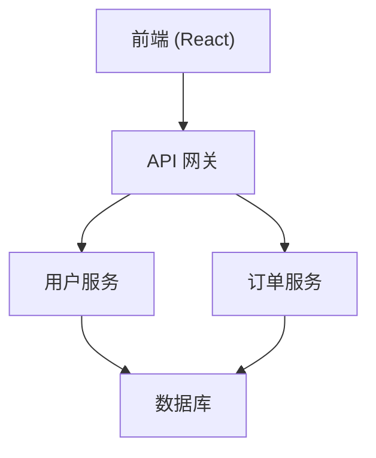

# {项目名称}

> 基于 [claude-enterprise-starter](https://github.com/circleone1980/claude-enterprise-starter) v2.5.0 模板开发

---

## 项目概述

<!-- 由 PM Agent 在 Phase 1 填充：项目的核心目标和价值主张 -->
<!-- 示例：
本项目是一个 [项目类型]，主要解决 [核心问题]。
目标用户是 [用户群体]，核心价值是 [价值主张]。
-->

---

## 技术栈

<!-- 由 Architect Agent 在 Phase 1 填充，从以下选项中选择实际使用的 -->

| 类别 | 选型 | 版本 |
|------|------|------|
| 前端框架 | React + TypeScript | 19+ |
| 构建工具 | Vite | 6+ |
| 包管理 | pnpm | 9+ |
| 前端测试 | Vitest + React Testing Library | - |
| 后端框架（Java） | Spring Boot + JPA | 3.x |
| 后端框架（Python） | FastAPI + Prisma | - |
| 数据库 | [待定] | - |
| API 规范 | RESTful / GraphQL | - |
| AI/ML 集成 | [待定] | - |
| 工作流引擎 | [待定] | - |

---

## 核心模块依赖

<!-- 由 Architect Agent 在 Phase 1 绘制 Mermaid 拓扑图 -->
<!-- 示例：

-->

---

## 项目结构

<!-- 由 Architect Agent 在 Phase 1 生成实际目录树 -->
<!-- 示例：
```
workspace/
├── src/
│   ├── frontend/          # React 前端
│   ├── backend/           # 后端服务
│   │   ├── java/          # Spring Boot
│   │   └── python/        # FastAPI
│   └── shared/            # 共享类型/工具
├── docs/
│   ├── requirements/      # 冻结层：PRD、用户故事
│   ├── design/            # 冻结层：系统设计
│   ├── dev/               # 演化层：开发指南
│   ├── test/              # 演化层：测试文档
│   └── superpowers/       # ADR + 脑暴
└── package.json
```
-->

---

## 导航指南

<!-- 填充后：想修改 X 功能 → 看 Y 文件 -->
<!-- 示例：
| 想做什么 | 重点关注 |
|---------|---------|
| 修改用户认证逻辑 | `src/backend/java/src/main/java/.../auth/` |
| 调整首页 UI | `src/frontend/src/pages/Home/` |
| 添加新 API 接口 | `docs/design/03_API接口设计.md` → 实现代码 |
| 修改数据库表结构 | `docs/design/02_数据库设计.md` → `docs/sql/` |
-->

---

## 开发指南

- 引擎模板详细手册: [GUIDE.md](../docs/GUIDE.md)
- 快速开始: [QUICKSTART.md](../QUICKSTART.md)
- 代码注释规范: [rules/08_code_comments.md](../rules/08_code_comments.md)

---

*README 由 claude-enterprise-starter 模板自动生成*
*开发阶段由 AI Agent 逐步填充上述占位内容*
