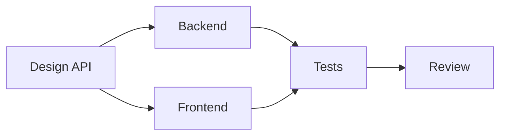

# Sprint Planning

A structured approach to planning and executing development sprints.

## Sprint Overview

| Parameter | Recommended Value |
|-----------|-------------------|
| Sprint Length | 2 weeks |
| Planning Timebox | 2-4 hours |
| Daily Standup | 15 minutes |
| Sprint Review | 1 hour |
| Sprint Retrospective | 1 hour |

## Planning Workflow

### Step 1: Gather Requirements

Collect and prioritize work items:
- Product backlog items ready for development
- Bug fixes requiring attention
- Technical debt to address
- Dependencies from previous sprints

### Step 2: Define Sprint Goal

Create a clear, measurable objective:
```
Sprint Goal: [What we aim to achieve by sprint end]

Success Metrics:
- [Measurable outcome 1]
- [Measurable outcome 2]
```

### Step 3: Break Down Tasks

Decompose features into actionable tasks:

```
Feature: User Authentication
├── Task 1.1: Design auth API (Architect) - 2h
├── Task 1.2: Implement JWT logic (Backend-1) - 4h
├── Task 1.3: Create login UI (Frontend-1) - 3h
├── Task 1.4: Write unit tests (QA) - 2h
├── Task 1.5: Integration testing (QA) - 2h
└── Task 1.6: Update documentation (PO) - 1h
```

### Step 4: Estimate Effort

Use story points or time estimates:

| Task | Estimate | Assignee | Dependencies |
|------|----------|----------|--------------|
| 1.1 Design API | 2h | Architect | None |
| 1.2 Implement JWT | 4h | Backend-1 | 1.1 |
| 1.3 Create UI | 3h | Frontend-1 | 1.1 |
| 1.4 Unit tests | 2h | QA | 1.2, 1.3 |
| 1.5 Integration | 2h | QA | 1.4 |
| 1.6 Docs | 1h | PO | 1.5 |

### Step 5: Assign Tasks

Use Claude Code task tools:
```bash
# Create sprint tasks
TaskCreate --subject "Sprint 1: User Auth" --description "..."

# Assign to team members
TaskUpdate --taskId "1" --owner "Backend-1"
TaskUpdate --taskId "2" --owner "Frontend-1"
```

### Step 6: Create Sprint Backlog

```markdown
# Sprint [N] Backlog

## Sprint Goal
[Clear objective for this sprint]

## Sprint Metrics
- Total Story Points: X
- Team Velocity: Y points/sprint
- Capacity: Z person-days

## Task Board

### 📋 To Do
- [ ] #1: Design auth API (Architect) - 2h
- [ ] #2: Implement JWT logic (Backend-1) - 4h

### 🔄 In Progress
- [ ] #3: Create login UI (Frontend-1) - 3h

### 👀 Review
- [ ] #4: Unit tests (QA) - waiting for review

### ✅ Done
- [x] #0: Setup sprint board (PM)

## Dependencies


## Risks
| Risk | Probability | Impact | Mitigation |
|------|-------------|--------|------------|
| ... | High/Med/Low | High/Med/Low | ... |
```

## Daily Standup Format

```markdown
## Standup [Date]

### Yesterday
- [Name]: Completed X, working on Y

### Today
- [Name]: Focus on Z

### Blockers
- [Name]: Waiting for [dependency]
```

## Sprint Review Checklist

- [ ] Demo all completed features
- [ ] Collect stakeholder feedback
- [ ] Document any scope changes
- [ ] Update product backlog
- [ ] Celebrate achievements

## Retrospective Format

```markdown
# Sprint [N] Retrospective

## What went well 🟢
- [Positive observations]

## What could improve 🟡
- [Areas for improvement]

## Action items 🔵
| Action | Owner | Due |
|--------|-------|-----|
| ... | ... | ... |
```

## Planning Checklist

Before starting the sprint:
- [ ] Sprint goal defined and communicated
- [ ] All tasks identified and estimated
- [ ] Dependencies mapped
- [ ] Resources assigned
- [ ] Risks assessed
- [ ] Capacity confirmed
- [ ] Definition of Done agreed

**Related Skills**: `product-requirements`, `writing-plans` (for architecture design)
