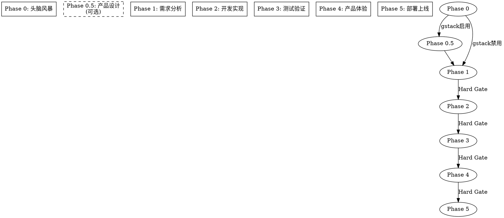
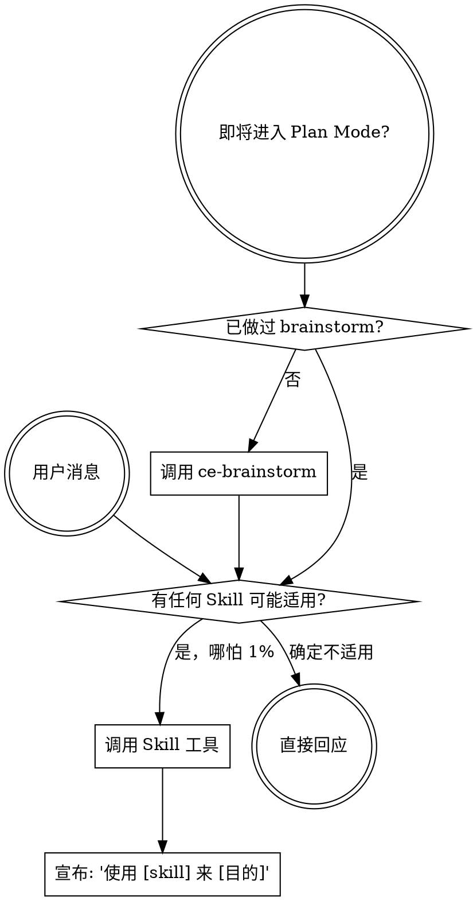

<SUBAGENT-STOP>
If you were dispatched as a subagent to execute a specific task, skip this skill.
如果你是作为子 agent 被调度来执行特定任务的，跳过本技能。
</SUBAGENT-STOP>

<EXTREMELY-IMPORTANT>
If you think there is even a 1% chance a skill might apply to what you are doing, you ABSOLUTELY MUST invoke the skill.

IF A SKILL APPLIES TO YOUR TASK, YOU DO NOT HAVE A CHOICE. YOU MUST USE IT.

This is not negotiable. This is not optional. You cannot rationalize your way out of this.
</EXTREMELY-IMPORTANT>

## 指令优先级

1. **用户明确指令**（CLAUDE.md、直接请求）— 最高优先级
2. **CE 框架 Skills** — 覆盖默认系统行为
3. **默认系统提示** — 最低优先级

用户决定 WHAT（做什么），Skills 决定 HOW（怎么做）。

## 如何访问 Skills

使用 `Skill` 工具调用。当你调用一个 Skill 时，其内容会被加载并呈现给你——直接遵循它。
永远不要用 Read 工具读取 Skill 文件。

## Iron Laws（铁律）

以下规则不可违反，没有例外。违反字面规则就是违反精神。

1. **TDD 铁律**：没有失败测试在前，不写生产代码。先红后绿再重构。
2. **验证铁律**：没有运行验证命令，不宣称完成。"应该可以了"不是验证。
3. **调试铁律**：没有根因分析，不提出修复方案。猜测式修复是失败。
4. **Review 铁律**：没有经过 code-review，不标记 Feature 完成。
5. **阶段铁律**：没有通过当前阶段门禁，不进入下一阶段。门禁由 Hook 强制执行。
6. **追踪铁律**：没有过程记录，产出物等于不存在。

## Red Flags（红旗表）

以下想法意味着 STOP——你在找借口绕过流程：

| 想法 | 现实 |
|------|------|
| "这只是个简单问题" | 问题是任务。检查 Skills。 |
| "我需要更多上下文" | Skill 检查在澄清问题之前。 |
| "让我先看看代码库" | Skills 告诉你如何探索。先检查。 |
| "这个不需要正式 Skill" | 如果 Skill 存在，就用它。 |
| "我记得这个 Skill 的内容" | Skills 会演化。读当前版本。 |
| "Skill 太重了，我直接做" | 简单事情变复杂是常态。用它。 |
| "我就先做这一件事" | 在做任何事之前先检查。 |
| "这个应该是后面阶段的事" | 检查当前阶段。不跳阶段。 |
| "先跳过测试，后面补" | TDD 铁律。没有例外。 |
| "门禁可以绕过" | 门禁是 Hook 强制的。绕不过。 |
| "我直接写代码就好了" | 先用 ce-brainstorm 或 brainstorming 探索方案。 |

## 阶段流程

### 各阶段必调 Skills

| 阶段 | 必调 Skills | 允许操作 |
|------|------------|---------|
| Phase 0 | `ce-brainstorm`, `design-context` | `docs/brainstorms/`, `.claude/` |
| Phase 0.5 | `office-hours`, `design-consultation`, `autoplan` | `workspace/docs/design/` |
| Phase 1 | `product-requirements`, `writing-plans`, `ce-plan` | `docs/requirements/`, `docs/design/`, `docs/reviews/` |
| Phase 2 | `ce-work`, `tdd`, `code-review` | `src/`, 所有目录 |
| Phase 3 | `verification-loop`, `ce-review`, `qa` | `docs/test/`, `src/` |
| Phase 4 | `user-onboarding`, `ui-ux-pro-max` | `docs/test/`, `src/` |
| Phase 5 | `ce-compound`, `security-review` | 所有目录 |

## Hard Gates（硬门槛）

每个 Gate 由 Hook 强制检查，不满足则操作被拦截（PreToolUse exit 1）。

### Phase 0 → Phase 1
- [ ] `docs/brainstorms/` 有 .md 文件
- [ ] 用户已确认方向
- [ ] 过程追踪已创建

### Phase 1 → Phase 2
- [ ] PRD.md 存在
- [ ] 系统架构设计存在
- [ ] 对抗审查已执行
- [ ] 冻结层文档已锁定
- [ ] 过程追踪完整

### Phase 2 → Phase 3
- [ ] 所有代码已实现
- [ ] 单元测试覆盖率 > 80%
- [ ] code-review 已完成
- [ ] 所有 Feature AC 验收通过

### Phase 3 → Phase 4
- [ ] 所有测试用例通过
- [ ] 集成测试 + E2E 测试通过
- [ ] 测试报告已输出

### Phase 4 → Phase 5
- [ ] 产品体验测试已完成
- [ ] 关键体验问题已修复

### Phase 5 → 完成
- [ ] 部署成功 + 健康检查通过
- [ ] 文档已更新 + 代码已推送

## Skill 优先级

当多个 Skills 可能同时适用时：

1. **流程 Skills 先调用**（ce-brainstorm, systematic-debugging）— 决定 HOW
2. **实现 Skills 后调用**（tdd, ce-work, springboot-patterns）— 指导执行
3. **验证 Skills 最后**（verification-loop, code-review, ce-review）— 确认质量

## Skill 调用决策

## 与 Superpowers 插件共存

如果你同时安装了 Superpowers 插件：
- CE 框架 Skills 管理项目级工作流（阶段、Agent、门禁）
- Superpowers Skills 管理开发实践（TDD、调试、review）
- 两者互补，不冲突
- CE 框架的 Hard Gates 和阶段流程优先
