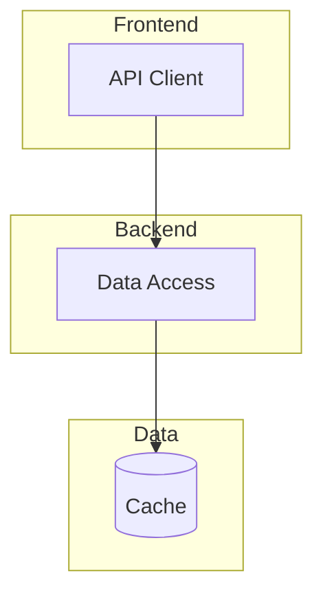

# Writing Plans（架构规划技能）

## 觍色定位

此技能专为 **Architect（架构师）** 角色设计，是架构师进行系统设计和功能拆解的核心技能。

---

## 核心职责

1. **系统架构设计** - 设计整体系统架构
2. **功能模块拆解** - 将需求拆解为可执行的功能模块
3. **技术方案制定** - 确定技术选型和实现路径
4. **接口设计** - 定义模块间的接口契约

---

## 工作流程

### Phase 1: 需求理解

```
1. 阅读需求文档
2. 理解业务目标
3. 识别技术约束
4. 确认非功能需求
```

### Phase 2: 架构设计

```
1. 设计系统架构图
2. 确定技术栈
3. 规划数据流
4. 定义部署架构
```

### Phase 3: 功能拆解

```
1. 识别核心功能
2. 拆分为模块
3. 定义模块边界
4. 设计模块接口
```

### Phase 4: 技术方案

```
1. 技术选型论证
2. API 设计
3. 数据库设计
4. 安全方案
```

---

## 架构文档模板

### 系统架构图

```markdown
# 系统架构

## 整体架构



## 技术栈

| 层级 | 技术 | 版本 |
|------|------|------|
| 前端 | React | 18.x |
| 后端 | FastAPI | 0.100+ |
| 数据库 | PostgreSQL | 15.x |
| 缓存 | Redis | 7.x |
```

### 功能模块拆分

```markdown
# 功能模块拆分

## Module: 用户认证

### 功能列表
- 用户注册
- 用户登录
- 密码重置
- Token 刷新

### 接口定义
```typescript
interface AuthService {
  register(data: RegisterDTO): Promise<User>;
  login(credentials: LoginDTO): Promise<Token>;
  logout(): Promise<void>;
  refreshToken(): Promise<Token>;
}
```

### 依赖关系
- 依赖: 数据库模块
- 依赖: 缓存模块

## Module: 订单管理

...
```

### 技术方案

```markdown
# 技术方案

## 1. 认证方案

### 选型: JWT + Refresh Token

**原因:**
- 无状态认证
- 支持多端
- 易于扩展

**实现:**
```python
from datetime import datetime, timedelta
import jwt

class AuthService:
    def create_tokens(self, user_id: str) -> tuple[str, str]:
        access_token = jwt.encode({
            "sub": user_id,
            "exp": datetime.utcnow() + timedelta(minutes=15)
        }, settings.JWT_SECRET)
        
        refresh_token = jwt.encode({
            "sub": user_id,
            "type": "refresh",
            "exp": datetime.utcnow() + timedelta(days=7)
        }, settings.JWT_SECRET)
        
        return access_token, refresh_token
```

## 2. 数据库方案

...
```

---

## 质量检查清单

### 架构设计检查

- [ ] 架构图清晰易懂
- [ ] 技术选型有理有据
- [ ] 模块边界明确
- [ ] 接口定义完整
- [ ] 扩展性考虑充分

### 功能拆分检查

- [ ] 功能粒度适当
- [ ] 依赖关系清晰
- [ ] 接口契约完整
- [ ] 可独立开发
- [ ] 可独立测试

### 技术方案检查

- [ ] 方案可行性验证
- [ ] 性能考量
- [ ] 安全考量
- [ ] 成本考量
- [ ] 运维考量

---

## 输出规范

### 必须输出

1. **系统架构图** - Mermaid 或 PlantUML 格式
2. **技术栈清单** - 包含版本和选型理由
3. **功能模块列表** - 包含接口和依赖
4. **技术方案文档** - 包含实现细节

### 建议输出

1. API 接口文档
2. 数据库设计
3. 部署架构
4. 风险评估

---

## 与其他技能协作

| 技能 | 协作点 |
|------|--------|
| `product-requirements` | 接收 PRD，转化为技术方案 |
| `react-best-practices` | 前端架构设计 |
| `prisma-database-setup` | 数据库架构设计 |
| `tdd` | 接口设计支持测试 |
| `code-review` | 架构方案审查 |

---

## 注意事项

1. **保持一致性** - 架构设计需与现有系统保持一致
2. **考虑扩展** - 设计需考虑未来扩展可能
3. **权衡取舍** - 记录架构决策的权衡过程
4. **文档同步** - 架构变更时同步更新文档

---

*技能版本: 1.0.0*
*适用于: Architect 角色*
